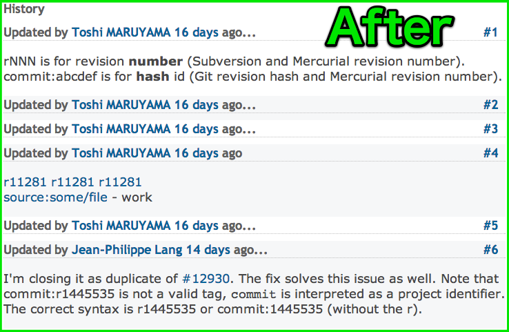

# Redmine Issue View Simplifier

This Chrome extension makes history list simpler in issue views of Redmine.

* This extension hides details of the history, which toggle show/hide for clicking titles.
* Items including hiding details are marked by "...".

# How To Install

1. Get source from GitHub
2. Edit manifest.json for your environment. You may add some Redmine URLs to "matches"
3. Launch Chrome and go to chrome://extensions/
4. Check "Developer mode" and then, click "Load unpacked extension..."
5. Select the folder of the extension
